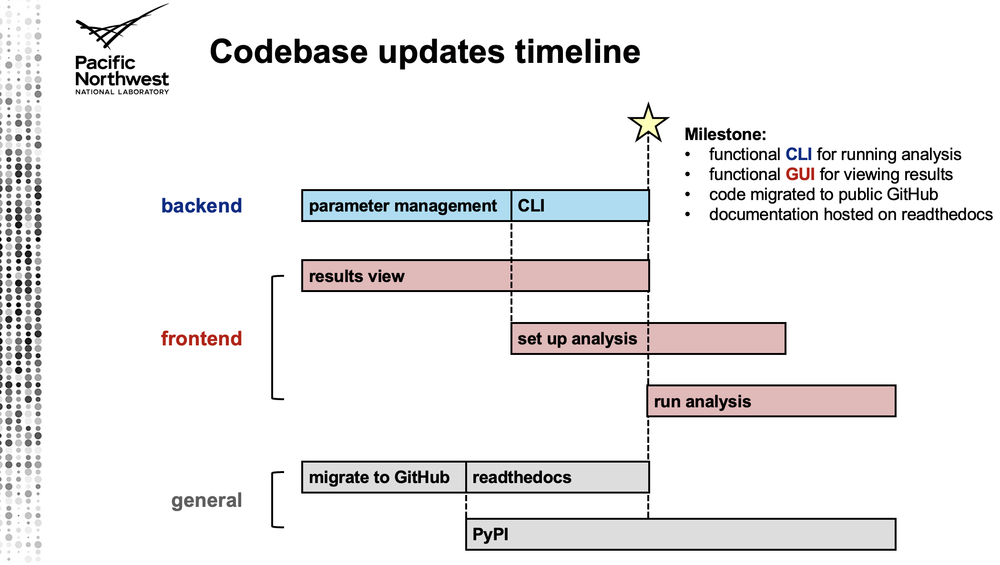

## Codebase updates checklist

### Frontend
- [ ] results view
    - [ ] change general model for fetching/displaying data
        - [ ] top panel is for browsing DIA features and lower panels display selected feature attributes
            - [ ] The top panel data can probably be fetched once and cached since it is not too much, but the rest of the feature-level data should only be fetched as it is needed
        - [ ] maintain a \(global\) variable in JS backend that tracks which `dia_feature_id` is currently selected
        - [ ] change logic for populating lower panels to only fetch and display data for the selected `dia_feature_id`
        - [ ] repopulating the lower panels should be triggered whenever the selected `dia_feature_id` is changed
        - [ ] each lower panel should have a backend JS function for populating it that fetches only the data it needs \(using currently selected `dia_feature_id`\) then displays it
        - [ ] suggest: put setting the variable for tracking currently selected `dia_feature_id` behind a setter function in JS backend, this can in turn trigger appropriate callbacks to repopulate lower panels whenever it gets called
    - [ ] get rid of "other DIA features from same DDA feature" lower panel
    - [ ] In top panel, add an empty box to allow user to enter a DIA feature ID, filter rows in the panel to display only that ID if found
    - [ ] display the flags from the database that indicate which data processing steps have been completed
- [ ] process data view 
    - [ ] set up analysis
        - [ ] update setting up analysis to accommodate new parameter config model
    - [ ] run analysis
        - [ ] update running analysis to reflect new backend CLI
        - [ ] update packaging of backend app using PyInstaller

### Backend
- [ ] adopt cleaner parameter configuration/management model \(like `tcdr.slim.params.SlimParams`\)
    - [x] nested dataclasses
    - [ ] load from default config then update explicitly specified params
    - [ ] reconcile the extra information that is included in the default configuration file that is used by the GUI to get default values and descriptions, not needed for actual data processing
    - [ ] reorganize into separate configuration files for each high-level analysis step
        - [ ] DDA
        - [ ] DIA
        - [ ] annotation
    - [ ] additional configs used in annotation should be loaded if the corresponding attribute of `AnnotationParams` is `None`, and the constants with paths to the default configs should be defined in `lipidimea.annotation` module 
- [ ] implement CLI for running data analysis
    - [ ] perform standard analyses
        - [ ] A. create results database \(+ other setup type tasks?\) 
        - [ ] B. run DDA feature extraction 
        - [ ] C. run DIA feature extraction \(requires DDA feature extraction first\)
        - [ ] D. lipid annotation \(requires DDA + DIA feature extraction first\)
        - [ ] E. export results to CSV \(requires DDA + DIA feature extraction first, annotation optional\)
        - [ ] F. run full workflow \(A-E\)
    - [ ] each analysis takes list of data files + associated parameter config file\(s\) as args \(where applicable\) 
    - [ ] add flags to database that indicate which steps have been completed
- [ ] clean up unit tests and get them running again
    - [ ] adopt unit testing framework used in `tcdr` codebase
- [ ] general code cleanup: module docstrings, indentation and other visual style, etc.

### General
- [ ] migrate to GitHub
- [ ] documentation build and host on readthedocs
- [ ] backend build and host on PyPI

---

# LipidIMEA
Lipidomics Integrated Multi-Experiment Analysis tool

- Documentation is available at https://lipidimea.readthedocs.io/

#### Contributors:
- Dylan Ross (dylan.ross@pnnl.gov)
- Jeremy Jacobson (jeremy.jacobson@pnnl.gov)
- Aivett Bilbao (aivett.bilbao@pnnl.gov)
- Xueyun Zheng (xueyun.zheng@pnnl.gov)

